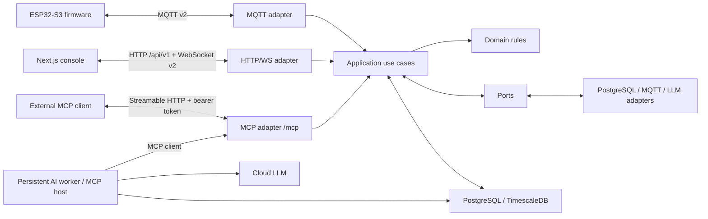
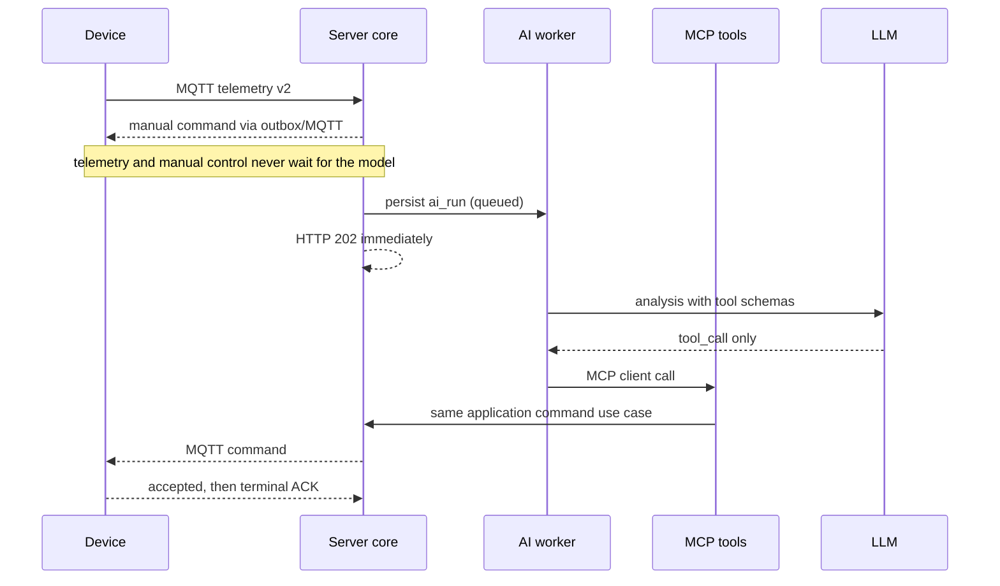

# IoTCmpt architecture

IoTCmpt uses a modular monolith on the server and ports/adapters at every external boundary. The design separates the device real-time path from the cloud-AI slow path.

## Responsibility boundaries

| Role | Owns | Must not own |
| --- | --- | --- |
| Firmware | sensing, hardware execution, local smoke rules, safety interlocks, command idempotency | cloud model calls, database queries, UI policy |
| Server | device twin, protocol adapters, command lifecycle, automation policy, AI jobs, audit and trace | hardware timing loops, presentation state |
| Web | state display, manual actions, configuration | direct MQTT, database or LLM access |
| Cloud LLM | asynchronous analysis, reports and MCP tool selection | direct firmware or broker access |

The firmware can reject any cloud command. Smoke and other safety behavior never waits for the server or model.

## Server layers

- `app/domain`: pure command and patrol rules.
- `app/application`: command, AI-run and policy use cases.
- `app/ports`: interfaces required by the application layer.
- `app/adapters`: PostgreSQL, outbox, MQTT, MCP, LLM and WebSocket implementations.
- `app/api`: FastAPI transport only.
- `app/main.py`: gateway dependency composition only.
- `app/worker_main.py`: independent AI worker and patrol scheduler composition.

`domain` and `application` cannot import FastAPI, SQLAlchemy, aiomqtt, the MCP SDK, HTTP model clients, or `app.adapters`. `tests/test_architecture.py` enforces this dependency direction.

## Fast path and slow path

Every command is written together with its outbox row before MQTT publication. `trace_id` connects the HTTP request, AI run, MCP call, command events, MQTT envelope, firmware ACK and WebSocket event.

## Versioned sources of truth

- `contracts/commands.json`: command name, parameters, safety class and AI exposure.
- `contracts/mqtt-envelope.schema.json`: MQTT v2 envelope.
- `contracts/device-capabilities.schema.json`: retained device capability payload.
- `contracts/websocket-events.json`: WebSocket v2 event names.
- `server/openapi.json`: HTTP `/api/v1` contract and generated WebSocket union.

Run `python tools/generate-contracts.py` after editing the command catalog. It generates the server Python catalog and firmware C header. CI runs the generator with `--check` and fails on drift.

## Deployment boundary

The gateway is one fixed single-process service containing HTTP, WebSocket, MQTT ingestion and the MCP server. AI workers are independent processes and may be safely scaled. `FOR UPDATE SKIP LOCKED` prevents concurrent claims; each claim also receives a unique `lease_token`. Every renewal, side-effect boundary and terminal update must still match `id + lease_owner + lease_token`, so a paused old Worker cannot resume after a newer Worker reclaimed the task. A separately fenced scheduler lease elects one patrol scheduler. PostgreSQL also carries Worker heartbeats and the realtime relay; Redis and Celery are not required.

Outbox and realtime relay use the same fencing pattern. MQTT input is deduplicated by `(device_id, topic, message_id)`. This means database ownership, broker QoS 1 redelivery, firmware `command_id` replay and frontend `event_id` deduplication form four independent reliability layers rather than one optimistic lock.

The browser and external clients use only `/api/v1`. There is no unversioned `/api` compatibility mount. Model provider settings and API keys are injected only into the worker; the gateway never creates an external LLM client.

## Verification boundary

The software architecture is covered by unit tests, Docker PostgreSQL/EMQX loops, two concurrent Workers, the firmware behavior simulator and ESP-IDF builds. Without a physical board, those checks do not prove USB enumeration, power integrity, actual GPIO wiring, PSRAM, camera timing, peripheral voltage levels or mechanical actuator movement.
