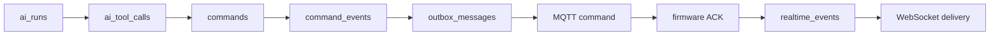

# Trace-based troubleshooting

Start with the `trace_id` shown in an HTTP response header, AI panel, MCP result, command row or log.

Query `GET /api/v1/diagnostics/traces/{trace_id}` first.

| Last visible stage | Likely owner | Check |
| --- | --- | --- |
| no `ai_run` | HTTP/client | response status, request trace header, validation body |
| `queued` never changes | AI worker | `/health/ready` or diagnostics Worker heartbeat, lease expiry, database connectivity |
| `waiting_model`/failed | LLM adapter | endpoint, key, timeout, provider response |
| tool call failed | MCP host/tool | token scope, tool arguments, `ai_tool_calls.error_message` |
| command queued only | outbox/MQTT adapter | broker connection and `outbox_messages.attempts` |
| published, no accepted | device transport | device online status, topic/device ID, firmware log |
| accepted, no terminal ACK | firmware handler | hardware task, safety interlock, reboot/boot ID |
| `waiting_device` never changes | firmware/transport | command terminal status, ACK timeout and MCP `device_get_command` |
| terminal command but stale UI | WebSocket/browser | event `trace_id`, reconnect snapshot, Query Cache reducer |

Repeated MQTT delivery is not itself a bug: firmware returns the stored terminal ACK for the same `command_id`. A different command ID with the same user action indicates the caller omitted or changed `idempotency_key`.

If two Worker instances appear in diagnostics, that is expected during scale-out. A Run must still show one current owner/token. A stale heartbeat is historical evidence, not a healthy Worker. A `late_device_ack` explains what the device eventually reported while the command remains `timed_out`.

LLM or MCP failure must not block telemetry ingestion, HTTP manual commands or firmware smoke handling. If those fast-path functions also fail, investigate the shared server/database/broker process rather than the model provider.
